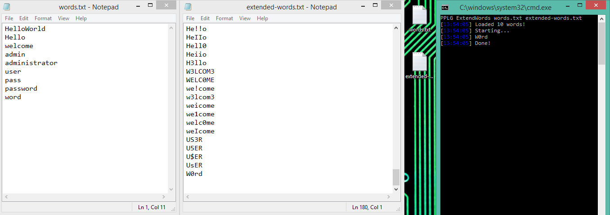
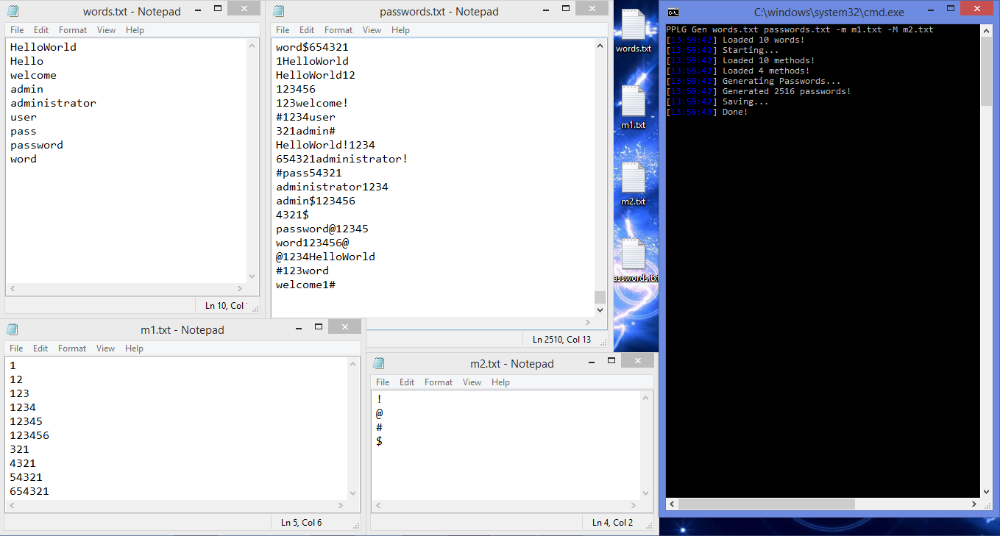

PyPassListGen
=====

PyPassListGen is a python script that allows you to generate password lists fast and easily.

Requirements
------------

- [Python 3.x](https://Python.org)
- [Cython](https://cython.readthedocs.io/en/latest/src/quickstart/install.html)
- [setuptools](https://pypi.org/project/setuptools/)
- [log21](https://github.com/MPCodeWriter21/log21)
- [importlib_resources](https://pypi.org/project/importlib-resources/)

*Note: You might need to install some of the requirements manually.*

Install PyPassListGen
----------------------

To install **PyPassListGen**, you can simply use the `pip install PyPassListGen` command:

```commandline
python -m pip install PyPassListGen
```

Or you can clone [the repository](https://github.com/MPCodeWriter21/PyPassListGen) and run:

```commandline
git clone https://github.com/MPCodeWriter21/PyPassListGen
cd PyPassListGen
```

```commandline
python3 setup.py install
```

Changes
-------

### 1.0.1
A bug fixed.

Usage
-----

```
usage: PPLG [-h] [--methods1 METHODS1] [--methods2 METHODS2]
            {ExpandWords,Gen,e,g} wordlist savepath

positional arguments:
  {ExpandWords,Gen,e,g}
                        ExpandWords(e): Makes new words using the built-in methods - Gen(g):
                        Generates passwords
  wordlist              The path to the wordlist file.
  savepath              The path to save the results.

optional arguments:
  -h, --help            show this help message and exit
  --methods1 METHODS1, -m METHODS1
                        The path to the file containing methods to be used(Default: PACKAGEPATH\m1.txt)
  --methods2 METHODS2, -M METHODS2
                        The path to the file containing methods to be used(Default: PACKAGEPATH\m2.txt)
```

Examples
--------

- Extend

```shell
PPLG ExtendWords words.txt extended-words.txt
```



----

- Generate Passwords

```shell
PyPassListGen Gen words.txt passwords.txt -m m1.txt -M m2.txt
```



About
-----
Author: CodeWriter21 (Mehrad Pooryoussof)

GitHub: [MPCodeWriter21](https://github.com/MPCodeWriter21)

Telegram Channel: [@CodeWriter21](https://t.me/CodeWriter21)

Aparat Channel: [CodeWriter21](https://www.aparat.com/CodeWriter21)